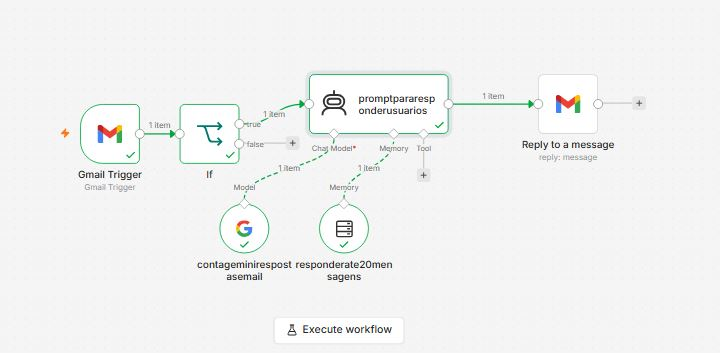

# Automação de E-mails com n8n e Gemini AI

Este projeto é um workflow criado no n8n para automação e resposta inteligente de e-mails recebidos via Gmail.

## Estrutura do Workflow

## Como utilizar
1. Baixe o arquivo `condicaoemail.json` presente neste repositório.
2. Abra seu painel do n8n e importe o arquivo JSON.
3. Configure as credenciais do Gmail e do Google Gemini.
